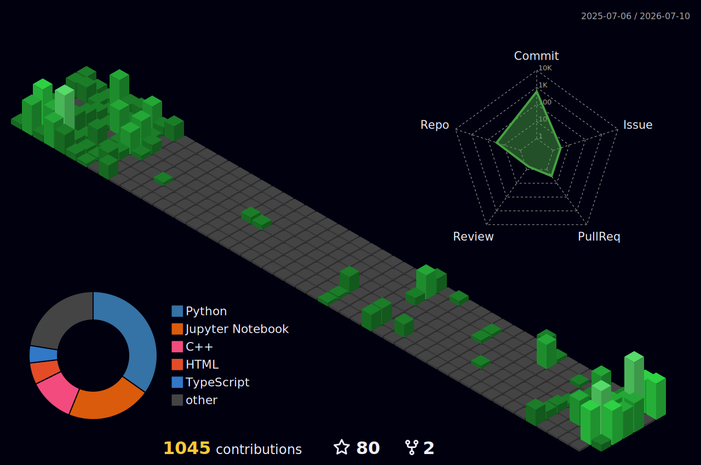

<h1 align="center">
  
</h1>

  

---

## About Me

I'm an **AI/DevOps Engineer** building production-ready systems — from infrastructure automation to AI-powered applications. Backend development is a core supporting skill, not the main focus. I believe in shipping things that actually run in production, not just tutorials that work on localhost.

Currently a Computer Science student at **PUCIT** (Punjab University College of Information Technology), and actively building **Gesty**, a premium hospitality invitation platform for the Saudi Arabian market.

---

## Areas of Expertise

> Following are the areas of tech I have hands-on experience in and have shipped real projects with:

### 1. DevOps & Infrastructure
- Containerization & Orchestration (Docker, Kubernetes — in progress)
- Infrastructure as Code (Terraform — in progress, Ansible)
- CI/CD Pipelines (GitHub Actions)
- Web Servers & Reverse Proxy (Nginx)
- Cloud (AWS — EC2, RDS, S3)
- Linux Systems Administration (Bash scripting, process management)

### 2. AI / ML / Agentic Systems
- LLM Integration (OpenRouter, Anthropic Claude API, Gemini)
- Agentic AI Workflows (LangChain, LangGraph)
- Workflow Automation (n8n)
- Data Analysis & Visualization (Pandas, NumPy, Matplotlib, Seaborn)
- Classical ML (Scikit-Learn, TensorFlow)

### 3. Backend Engineering
- API Development (FastAPI, Express.js, NestJS)
- Databases (PostgreSQL, Supabase, Prisma ORM)
- Async Job Processing (BullMQ, Redis)
- Authentication (JWT, RBAC, bcrypt)
- Realtime Systems (Supabase Realtime, WebSockets)

### 4. Frontend (Supporting Skill)
- React.js, Next.js
- Tailwind CSS

---

## Portfolio Projects

### AlertMind — AI-Powered On-Call Assistant
**Live:** [alertmind-dashboard.vercel.app](https://alertmind-dashboard.vercel.app/)

- Receives infrastructure alerts (CPU, memory, latency, error rate) via FastAPI webhooks
- Correlates alerts with real GitHub commit history to identify the exact guilty commit and author
- AI root cause analysis using Gemini via OpenRouter with structured output parsing
- Posts diagnosis + fix suggestion to Slack with interactive Block Kit buttons (Acknowledge / Resolve)
- Real-time Next.js dashboard with search, filters, and alert history
- Stripe billing integration with tiered subscription plans
- Full Docker + GitHub Actions CI/CD pipeline

**Tech Stack:** `Python` · `FastAPI` · `Next.js` · `PostgreSQL` · `Supabase` · `Docker` · `GitHub Actions` · `OpenRouter` · `Slack SDK` · `Stripe`

---

### University Management Portal — Production App, 65+ Active Students
**Live:** [university-portal-frontend-nu.vercel.app](https://university-portal-frontend-nu.vercel.app/)

- Full grade management system with PU's weighted grading logic (Sessionals/Midterm/Final)
- JWT authentication with bcrypt hashing, rate limiting, and role-based access (Admin/TA/Student)
- CSV bulk marks import — TAs upload an entire class roster in one shot
- Marks analytics: class average, pass rate, per-assessment breakdowns
- Student ranking & comparison against class average (fully anonymized)
- Mark change audit log — every edit tracked with who changed what and when
- PDF transcript export and full JSON data backup
- **v2 rebuild:** migrated from Railway to Vercel Serverless + Supabase with PgBouncer connection pooling after production database failures during exam season — fixed serverless/Postgres connection mismatches under real load

**Tech Stack:** `React.js` · `Node.js` · `Express.js` · `PostgreSQL` · `Supabase` · `Prisma ORM` · `JWT` · `Vercel`

---

### CipherGuard — DSA-Based Cybersecurity Analyzer
**Live:** [cipher-guard-gamma.vercel.app](https://cipher-guard-gamma.vercel.app/)

A full-stack cybersecurity toolkit covering multiple attack surfaces and defensive utilities, with core logic built on data structures and algorithms:

- `anomaly_detector` — behavioral anomaly detection in system logs
- `cipher_breaker` — classical cipher analysis & breaking
- `file_integrity` — file hash verification & tamper detection
- `password_analyzer` / `password_vault` — strength scoring & encrypted credential storage
- `rsa_generator` — RSA key pair generation
- `steganography` — image-based data hiding & extraction
- `threat_graph` — threat relationship mapping using graph structures
- `log_generator` — synthetic log generation for testing

**Tech Stack:** `Python` · `FastAPI` · `React.js` · `Cryptography` · `DSA (Graphs, Hash Maps, Trees)` · `Vercel`

---

### Gesty — Premium Hospitality Invitation Platform *(In Development)*

A three-actor digital invite and venue redemption platform (Sender, Recipient, Merchant) built for the Saudi Arabian luxury events market.

- Full KSA regulatory compliance: SAMA, ZATCA FATOORA e-invoicing, PDPL
- Arabic RTL as a Day 1 requirement
- Mada and STC Pay payment integration
- Web-based flows to avoid platform in-app purchase cuts
- AI features structured as async background jobs

**Tech Stack:** `Node.js` · `PostgreSQL` · `Supabase` · `BullMQ` · `AWS (RDS Bahrain)` · `Claude API` · `RBAC`

---

## Tech Stack

#### Languages
`Python` · `C/C++` · `JavaScript` · `TypeScript` · `SQL` · `Bash`

#### DevOps & Infrastructure

  
  
  
  
  
  
  
  
  

#### AI / ML / Automation

  
  
  
  
  
  
  
  
  
  
  

#### Backend & Databases

  
  
  
  
  
  
  
  
  

#### Frontend

  
  
  

#### Systems & Languages

  
  

#### Developer Tools

  
  
  
  

---

## Engineering Focus

I focus on building **clean, automated, production-grade systems** with an emphasis on:

- Automation-first workflows — if it can be scripted or scheduled, it shouldn't be manual
- Infrastructure that doesn't break under real-world load (learned this the hard way during exam season)
- AI features designed as async background jobs, not blocking request paths
- Compliance and security built in from day one, not retrofitted later

---

## GitHub Activity

  

  
  

  

### 3D Contribution Graph

  

### Contribution Snake

  

<table align="center">
  <tr>
    <td align="center"><strong>GitHub Heatmap</strong>  
      
    </td>
    <td align="center"><strong>LeetCode Stats</strong>  
      
    </td>
  </tr>
</table>

  

---

## Connect With Me

  
  
  

---

  <i>"The quieter you become, the more you are able to hear." – Maulana Rumi</i>

